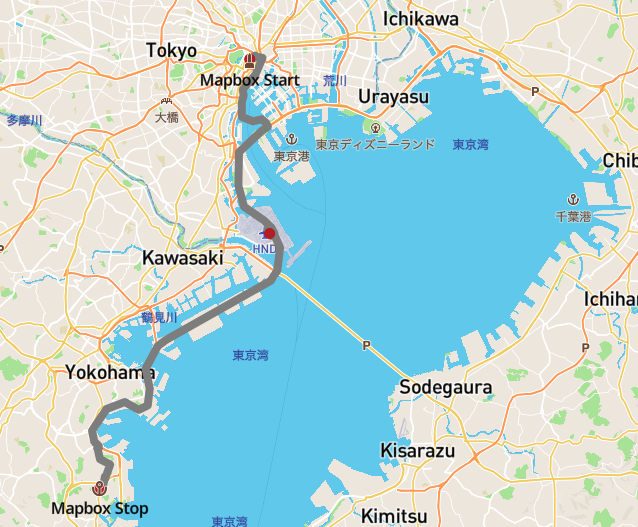

# Mapbox Tech Workshop 4 - Roadtrip!!

## はじめに

このモジュールではGLJS、Mapbox PlaygroundとAPIを用いて、想定される課題を解決する方法を学んでいただきます。

実現すべき内容としては、

- 特定の場所（東京駅）から目的地間のドライブ可能なルートを計算する
- カスタマイズしたマップ上で旅程を表示する

このモジュールを通じて学んでいただくこと:

1. Mapbox Playgroundの活用
2. Search APIリクエストと行き先(Directions)リクエスト
3. ジオメトリを行き先リクエストから取得して、マップに表示する方法

## 事前準備
1. IDE([Visual Studio Code](https://code.visualstudio.com/)等)

### Search Playground
1. ブラウザで[Search Playground](https://docs.mapbox.com/search-playground/#{%22url%22:%22%22,%22index%22:%22mapbox.places%22,%22approx%22:true,%22staging%22:false,%22onCountry%22:true,%22onType%22:true,%22onProximity%22:true,%22onBBOX%22:true,%22onLimit%22:true,%22onLanguage%22:true,%22countries%22:[],%22proximity%22:%22%22,%22typeToggle%22:{%22country%22:false,%22region%22:false,%22district%22:false,%22postcode%22:false,%22locality%22:false,%22place%22:false,%22neighborhood%22:false,%22address%22:false,%22poi%22:false},%22types%22:[],%22bbox%22:%22%22,%22limit%22:%22%22,%22autocomplete%22:true,%22languages%22:[],%22languageStrict%22:false,%22onDebug%22:false,%22selectedLayer%22:%22%22,%22debugClick%22:{},%22localsearch%22:false,%22query%22:%22%22})を開く
1. 今回のルートの起点となる`東京駅`を入力


1. JSONレスポンスを確認、多くの結果が確認できます
1. `Limit`を1に設定
1. `Toggle JSON Panel` JSONレスポンスを再度確認、どのような内容が取得できてるでしょうか


1. 座標をJSONの中から確認してください
1. 起点(origin)として登録します。チャットウィンドウ、あるいはワークシートに各自の内容を共有してください
1. 次に、行先を選択するために、一旦Limitの数字を削除して下さい。
1. `金沢`を検索してみてください


1. Proximity Bias[1]によるランキング結果の改善

    - `神奈川` を検索
    - JSONレスポンスで座標を取得
    - Proximity Biasボックスに上記座標を追加
    - 再度`金沢`を選択
    
    

1. JSONレスポンスからcoordinatesを取得し、チャットウィンドウ、あるいはワークシートに各自の内容を共有してください
1. Playgroundの使い方を確認する

|`Open API URL`をクリック、ブラウザにてリクエストを実施|`Toggle Raw URL` ビューにて、自身のリクエストを作成|APIリクエストURLにペーストしながら、各パラメータを確認|
|-|-|-|
||||

*ドキュメントへのリンク`i`をクリックして、各機能を確認できます*

### Directions Playground
1. [Directions API Playground](https://docs.mapbox.com/playground/directions/) を開きます
1. 先ほど調べた座標を入力します


1.  `Route` ボタンをクリックして、ルートを表示

1. `Response`ウィンドウにて応答が確認できます。どのようにジオメトリを取得できるでしょうか。ジオメトリが示しているものは何でしょうか。  

1. 表示の簡素化のため、Turn by Turnのオプションをオフにしてみましょう。
    - `Optional parameters` > `steps`

1. ジオメトリのフォーマットを変えてみましょう
    - `Optional parameters` > `geometries`


### コーディング
1. テキストエディタを開いて、`Rordtrip.html`というファイルを保存します
2. GLJSのExampleページに移動
    https://docs.mapbox.com/mapbox-gl-js/example

1. マップ上にルートの線を引くサンプルを検索してみてください
2. サンプルをペーストして、実行してみてください
3. サンプルを、先の経路でアップデートするにはどうしたら良いでしょうか。
4. サンプルを編集して、ブラウザで起動してみてください
5. 開始点と終了点を追加してみてください。どうやったら実現できるでしょうか。


## やってみよう
1. どのようにしたら、途中に経由地を追加することができますか？

1. そこからのルートはどうでしょうか?

1. スタイルはどのように変更できるでしょうか?

参考: ソースの追加:

```
    map.addSource("Waypoints", {
                "type": "geojson",
                "data": {
                    "type": "FeatureCollection",
                    "features": [{
                        "type": "Feature",
                        "geometry": {
                            "type": "Point",
                            "coordinates": //<Start of your roadTrip>
                        }
                    }, {
                        "type": "Feature",
                        "geometry": {
                            "type": "Point",
                            "coordinates": //<End of your roadtrip>
                        }

                    }]
                }
            });
```


参考: レイヤの追加:

```
        map.addLayer({
            "id": "Waypoints",
            "type": "circle",
            "source": "Waypoints",
            "paint": {
                "circle-radius": 6,
                "circle-color": "#B42222"
            },
            "filter": ["==", "$type", "Point"],
        });

```

## お疲れ様でした

# ワークシート


# 参考情報


# Parking Lot
- 精度について
- 中心部と座標の違い
- 同じ地図なのになぜ違う地点が出るのでしょうか


# Sample Screeshots





----------

[1]
Bias the response to favor results that are closer to this location, provided as two comma-separated coordinates in `longitude,latitude` order.
